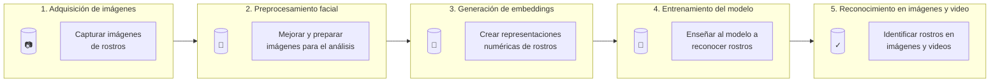
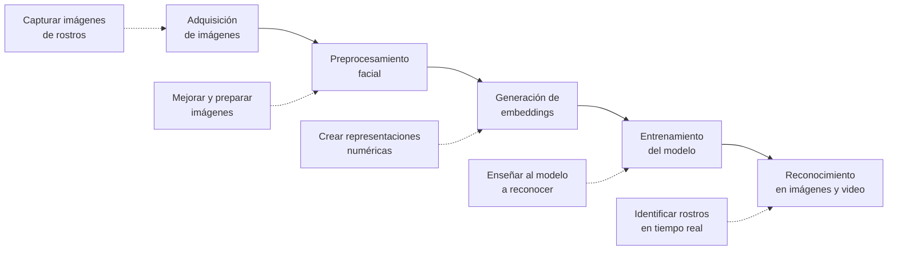
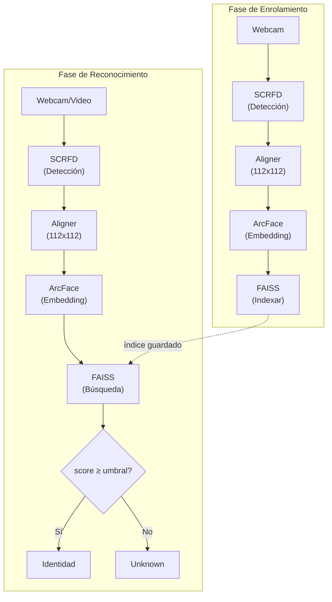

# Diagrama de Arquitectura del Sistema de Reconocimiento Facial

## Diagrama Mermaid

## Versión simplificada

## Mapeo con componentes del proyecto

| Etapa | Descripción | Componente en el código |
|-------|-------------|------------------------|
| 1. Adquisición | Capturar imágenes de rostros | `video_io.py` (WebcamSource) |
| 2. Preprocesamiento | Detectar ROIs + Alinear | `detector_scrfd.py` + `aligner.py` |
| 3. Embeddings | Crear vectores 512-D | `embedder_arcface.py` |
| 4. Entrenamiento | Construir índice FAISS | `matcher_faiss.py` (build) |
| 5. Reconocimiento | Buscar identidad similar | `recognition.py` + `matcher_faiss.py` (search) |

## Diagrama técnico del proyecto

