# Diagrama de Arquitectura del Sistema de Reconocimiento Facial

## Diagrama Mermaid

```mermaid
flowchart LR
    subgraph A["1. Adquisición de imágenes"]
        A1[("📷")]
        A2["Capturar imágenes<br/>de rostros"]
    end

    subgraph B["2. Preprocesamiento facial"]
        B1[("👤")]
        B2["Mejorar y preparar<br/>imágenes para el análisis"]
    end

    subgraph C["3. Generación de embeddings"]
        C1[("🔢")]
        C2["Crear representaciones<br/>numéricas de rostros"]
    end

    subgraph D["4. Entrenamiento del modelo"]
        D1[("🧠")]
        D2["Enseñar al modelo a<br/>reconocer rostros"]
    end

    subgraph E["5. Reconocimiento en imágenes y video"]
        E1[("✓")]
        E2["Identificar rostros en<br/>imágenes y videos"]
    end

    A --> B --> C --> D --> E
```

## Versión simplificada

```mermaid
flowchart LR
    A["Adquisición<br/>de imágenes"] --> B["Preprocesamiento<br/>facial"]
    B --> C["Generación de<br/>embeddings"]
    C --> D["Entrenamiento<br/>del modelo"]
    D --> E["Reconocimiento<br/>en imágenes y video"]

    A1["Capturar imágenes<br/>de rostros"] -.-> A
    B1["Mejorar y preparar<br/>imágenes"] -.-> B
    C1["Crear representaciones<br/>numéricas"] -.-> C
    D1["Enseñar al modelo<br/>a reconocer"] -.-> D
    E1["Identificar rostros<br/>en tiempo real"] -.-> E
```

## Mapeo con componentes del proyecto

| Etapa | Descripción | Componente en el código |
|-------|-------------|------------------------|
| 1. Adquisición | Capturar imágenes de rostros | `video_io.py` (WebcamSource) |
| 2. Preprocesamiento | Detectar ROIs + Alinear | `detector_scrfd.py` + `aligner.py` |
| 3. Embeddings | Crear vectores 512-D | `embedder_arcface.py` |
| 4. Entrenamiento | Construir índice FAISS | `matcher_faiss.py` (build) |
| 5. Reconocimiento | Buscar identidad similar | `recognition.py` + `matcher_faiss.py` (search) |

## Diagrama técnico del proyecto

```mermaid
flowchart TB
    subgraph Enrollment["Fase de Enrolamiento"]
        E1["Webcam"] --> E2["SCRFD<br/>(Detección)"]
        E2 --> E3["Aligner<br/>(112x112)"]
        E3 --> E4["ArcFace<br/>(Embedding)"]
        E4 --> E5["FAISS<br/>(Indexar)"]
    end

    subgraph Recognition["Fase de Reconocimiento"]
        R1["Webcam/Video"] --> R2["SCRFD<br/>(Detección)"]
        R2 --> R3["Aligner<br/>(112x112)"]
        R3 --> R4["ArcFace<br/>(Embedding)"]
        R4 --> R5["FAISS<br/>(Búsqueda)"]
        R5 --> R6{"score ≥ umbral?"}
        R6 -->|Sí| R7["Identidad"]
        R6 -->|No| R8["Unknown"]
    end

    E5 -.->|"índice guardado"| R5
```

